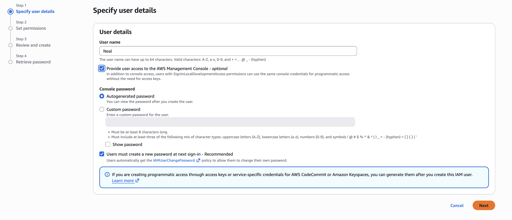

# AWS IAM User and Access Management Lab

## Objective  
The goal of this project was to understand how AWS Identity and Access Management (IAM) controls who can access resources and what actions they are allowed to perform.
Rather than creating users in isolation, I focused on structuring access through groups and policies to reflect how permissions are managed in a real environment.  

---
## What I Built
- Created three IAM user groups:
    - Admins
    - Data Scientits
    - Power Users
- Attached AWS managed polices to each group based on job function
- Created individual users and assigned them to groups
- Enabled console access with secure login setup

---
## How IAM Works (My Understanding)
IAM operates on two core ideas: authentication and authorization.  

Authentication answers the question:   
Who are you? 

Authorization answers the question:   
What are you allowed to do? 

In AWS, every request must first be authenticated. Once identity is confirmed, polices determine whether access is allowed or denied. 

Users can access AWS in three ways: 

- Management Console using username and password
- Command Line Interface (CLI) using access keys
- API using access keys

Short term credentials can also be generated through AWS Securtiy Token Service 

---
## Key Concepts I Applied 
- **Users** represent individual identities
- **Groups** organize users with similar responsibilities
- **Policies** define permissions
- **Roles** allow temporary access through delegation

Users have no permissions by default. Access must be explicilty granted. 
Instead of assigning permissions directly to each user, I applied policies to groups. Users inherit permissions from the groups they belong to. 
This approach reduces management overhead and creates a scalable structure. 

---
## Why This Matters 
From a management perspective, group based access control is a game changer. Instead of managing permissions user by user, access is defined once at the group level and applied consistently. 
If roles change, permissions can be updated in one place. 
This reduces errors, improves security, and makes systmes easier to maintain. 

---
## Architecture Overview (Conceptual) 
Requests can come from the AWS Management Console, CLI, or API. 
All requests pass through IAM for authentication and authorization. 
IAM evaluates the request against policies attached to users, groups, or roles. 
If allowed, the request reaches the target service such as EC2, S3, or IAM itself. 

---
## Screenshots 
### IAM Dashboard
 
### User Groups Created
 
### User Creation and Group Assignment
 
### Policy Attached to Group

---
## Lessons Learned 
- Users do not have permission by default
- Group based access contorl simplifies management
- Policies are the foundation of authorization
- Authentication must occur before any AWs request is processed
- IAM structure directly impacts security and scalability
---
## What I Would Improve 
- Apply stricter least privilege policies instead of broad managed policies
- Use roles more extensively for temporary access
- Integrate IAM with monitoring and auditing tools
- Avoid long term credentials where possible
---
## Final Thoughts 
This project shifted how I think about access. 
It is not just about creating users. It is about designing a system where access is controlled, scalable, and intentional. 
In my opinion, this is where cloud security begins. 

